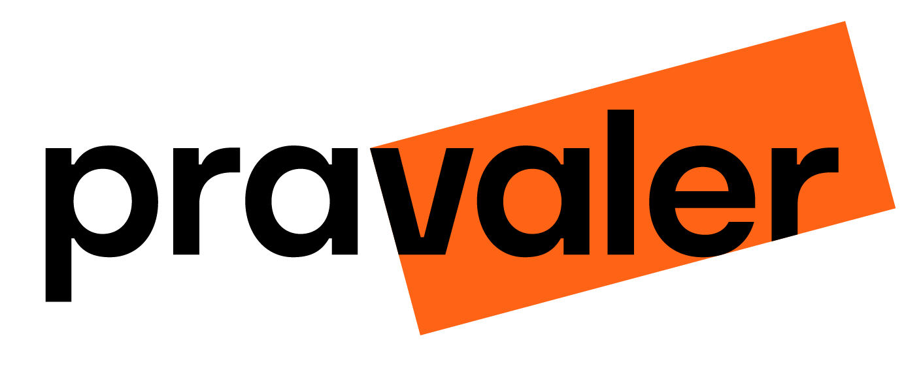

## Índice :rocket:

- [1. Descrição](#1-descrição)

- [2. Planejamento](#2-planejamento)

- [3. Protótipo](#3-Protótipo)

- [4.Tecnologias Utilizadas](#4-tecnologias-utilizadas)

- [5. Desenvolvedoras](#7-desenvolvedoras)

### 1. Descrição :pencil:
Desafio real proposto pela Pravaler. Implementamos o que aprendemos em termos técnicos e socioemocionais ao longo do Bootcamp.

###  2. Planejamento :bulb:
A equipe utilizou a ferramenta Trello para fazer todo o planejamento e organização do projeto. Abaixo a imagem do quadro que a equipe criou para tal fim. Se quiser saber um pouco mais sobre o planejamento do projeto, basta acessar nosso quadro através desse `<link>` [Trello](https://trello.com/b/Fb5RufFT/pravaler)

### 3. Protótipo :computer:
A seguir, está o protótipo inicial do site. Um fluxograma da criação das funcionalidades do site e um fluxo dos processos para criação do projeto.

### 4. Tecnologias Utilizadas :computer:
Para a realização deste projeto 

### 5. Desenvolvedoras  :camera_flash:
Para conhecer um pouco mais do trabalho de cada uma das desenvolvedoras desse projeto, clique nos seus nomes a seguir:

:woman_student: <a href="https://github.com/Costahadassa">Hadassa Costa </a>

:woman_student: <a href="https://github.com/JulianaAmoriN">Juliana Silveira</a> 

:woman_student: <a href="https://github.com/Kaueny-Alves">Kaueny Alves </a>

:woman_student: <a href="https://github.com/RobertaKelly">Roberta Kelly</a>

:woman_student: <a href="https://github.com/Talita-8">Talita Silva </a> 
